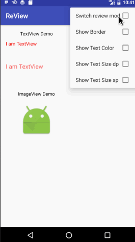

# ReView
A view to help developers and designers view the View's font size, color, and border, so far, it only support TextView Button and ImageView.



## Usage
### Step 1
Add the JitPack repository to your build file
```groovy
allprojects {
	repositories {
		...
		maven { url "https://jitpack.io" }
	}
}
```

### Step 2
Add the dependency
```groovy
dependencies {
	 compile 'com.github.maoruibin:ReView:1.0.1'
}
```

### Step 3
Edit your layout XML:
~~~ xml
<com.github.maoruibin.RVTextView
    android:layout_width="wrap_content"
    android:layout_height="wrap_content"
    android:text="I am TextView"
    android:textColor="#f00000"
    android:textSize="15sp"/>
    
<com.github.maoruibin.RVButton
    android:layout_width="wrap_content"
    android:layout_height="wrap_content"
    android:text="I am TextView"
    android:textColor="#f00000"
    android:textSize="15sp"/>
    
<com.github.maoruibin.RVImage
    android:layout_width="wrap_content"
    android:layout_height="wrap_content"
    android:text="I am TextView"
    android:textColor="#f00000"
    android:textSize="15sp"/>
~~~

## License

    Copyright 2016 GuDong
    
    Licensed under the Apache License, Version 2.0 (the "License");
    you may not use this file except in compliance with the License.
    You may obtain a copy of the License at
    
        http://www.apache.org/licenses/LICENSE-2.0
    
    Unless required by applicable law or agreed to in writing, software
    distributed under the License is distributed on an "AS IS" BASIS,
    WITHOUT WARRANTIES OR CONDITIONS OF ANY KIND, either express or implied.
    See the License for the specific language governing permissions and
    limitations under the License.
